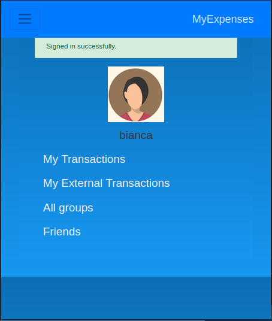
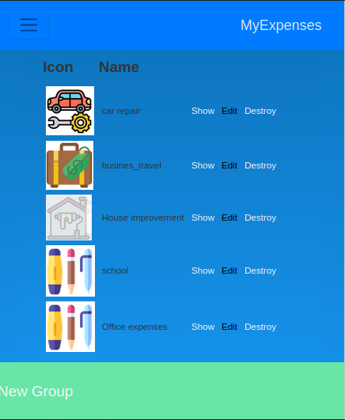
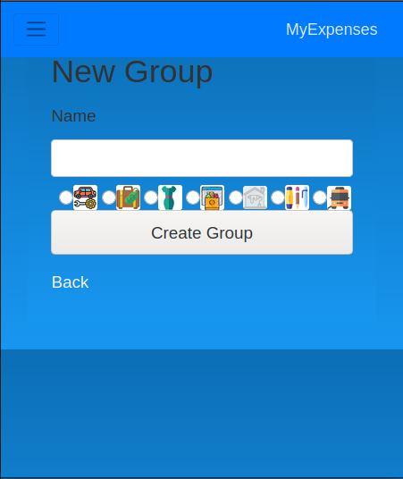

# Transaction expenses tracking by categories

> This application helps you to keep tracking of all your transaction's expenses allowing you to keep control by transaction categories to help to create detailed budgets, and allows you to create all the groups you may need to have a more exact account of which aspects of your daily living or project are costing more.








## Built With

- Ruby v2.7.0
- Ruby on Rails v5.2.4
- Postgress
- Bootstrap 4.5

## Live Demo

[Live on Heroku!](https://transcpb-track.herokuapp.com)

## Video Presentation

[Presentation Video](https://www.loom.com/share/40554e084df34b1992bc36342e6e5f31)

## Getting Started

To get a local copy up and running follow these simple example steps.

### Prerequisites

Ruby: 2.7
Rails: 5.2.3
Postgres: >=9.5

### Setup

Instal gems with:

```
bundle install
```
Setup database with:

```
   rails db:create
   rails db:migrate
```

### Usage

Start server with:

```
    rails server
```

Open `http://localhost:3000/` in your browser.

To login into the application just type email and password.
A profile page will open that includes links to:
- My Transactions
- My External Transactions
- All groups
When you open "All my expenses" page:
- At the top of the page you can see the total of your grouped transactions
- A list of all grouped transactions you have created.
- At the bottom or the page there is a button that allow you to create a new transaction.
When you open "My External Transactions" page:
- A list of all  not assigned  transactions to any group.
When you open "All groups" page:
- It will show a list of existing groups for your transactions.
- At the bottom or the page there is a button that allow you to create a new group.
When you open the "show link" in page:
- A list of all transactions that belong to that group is displayed.
When user clicks "New Group" or "New transactions".
- A form with fields required will be opened.

### Run tests

```
    rpsec --format documentation
```

> Tests will be added by Microverse students. There are no tests for initial features in order to make sure that students write all tests from scratch.

### Deployment

TBA

## Authors

👤 **Carlos Prieto**
- Github: [@carlosprietobarron](https://github.com/carlosprietobarron)
- Linkedin: [Carlos Prieto](https://www.linkedin.com/in/carlos-prieto-41a2b018b/)
- Email: [Carlos Prieto Barrón](carloprietobarron@gmail.com)

## 🤝 Contributing

Contributions, issues and feature requests are welcome!

Feel free to check the [issues page](issues/).

## Show your support

Give a ⭐️ if you like this project!

## Acknowledgments

- [Microverse](https://github.com/carlosprietobarron)

- [Gregoire Vella on Behance](https://www.behance.net/gregoirevella)

## 📝 License

- This project is [MIT](https://github.com/Elbie-em/Expenses-Tracker-App/blob/development/LICENSE) licensed.

